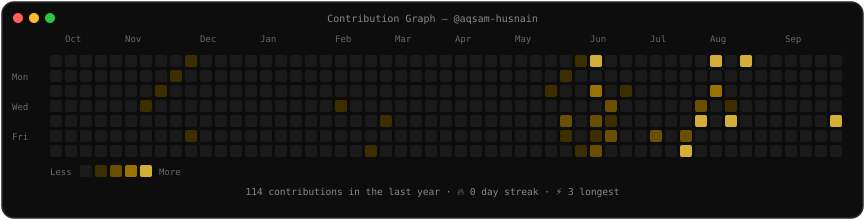

# ⚡ Wajahat Abbas

### Full-Stack Software Engineer • AI Systems Architect • Distributed Systems Craftsman

  
  &nbsp;
  
  &nbsp;
  

  

---

### <code>Developer Terminal &amp; System Specs</code>

<table align="center" border="0" cellspacing="0" cellpadding="0">
  <tr>
    <td align="center" valign="middle">
      
    </td>
    <td align="center" valign="middle">
      
    </td>
  </tr>
</table>

---

### <code>Telemetry &amp; Activity Matrix</code>

  

 

  
  &nbsp;
  

---

### 🚀 Featured Engineering Portfolio (33 Repositories)

| Project | Release Era | Primary Stack | Architecture Highlights |
| :--- | :---: | :--- | :--- |
| [**CodeClarity AST Security Reviewer**](https://github.com/wajahatabbsalvi/codeclarity-ast-security-analyzer) | `2026` | Python 3.12, FastAPI, Claude 3.5, Tree-sitter | Abstract Syntax Tree vulnerability detection and AI-guided refactoring diff engine |
| [**OllamaStudio Local LLM Workbench**](https://github.com/wajahatabbsalvi/ollamastudio-local-llm-workbench) | `2026` | React 19, Vite, TypeScript, Ollama REST API | In-browser client interface for local LLM inference, prompt tweaks, and streaming tokens |
| [**Qdrant Hybrid Vector Search Core**](https://github.com/wajahatabbsalvi/qdrant-hybrid-vector-search) | `2025` | Python 3.12, FastAPI, Qdrant, BM25, FastEmbed | Reciprocal Rank Fusion (RRF) combining dense neural vectors and sparse BM25 tokens |
| [**RAGCore Semantic Knowledge Base**](https://github.com/wajahatabbsalvi/ragcore-semantic-knowledge-base) | `2025` | Python 3.12, LangChain, ChromaDB, FastAPI | Recursive token chunking with semantic boundaries, multi-query expansion, and QA memory |
| [**DocuParse Multimodal Document Extractor**](https://github.com/wajahatabbsalvi/docuparse-multimodal-extractor) | `2025` | Python 3.12, FastAPI, GPT-4 Vision, OCR, Celery | Multimodal LLM document parsing into schema-validated JSON with confidence score validation |
| [**StreamQueue Distributed Event Bus**](https://github.com/wajahatabbsalvi/streamqueue-distributed-bus) | `2025` | Python 3.11, Redis Streams, Celery, Docker | Partitioned consumer group messaging broker with dead-letter queue (DLQ) retry routing |
| [**MeterRate Consumption Billing Engine**](https://github.com/wajahatabbsalvi/meterrate-consumption-billing-engine) | `2025` | Python 3.11, FastAPI, Stripe Metered API, Redis | High-frequency API request metering engine tracking credit usage and computing invoices |
| [**CloudMesh Container Runtime Manager**](https://github.com/wajahatabbsalvi/cloudmesh-container-runtime) | `2024` | Go, Docker Engine API, Prometheus, REST | Distributed container monitoring daemon with automatic restart recovery heuristics |
| [**FormForge Dynamic Schema Builder**](https://github.com/wajahatabbsalvi/formforge-schema-builder) | `2024` | Next.js 14, TypeScript, Zod, React Hook Form | Drag-and-drop JSON-Schema form builder with dynamic client/server Zod validation |
| [**PayStream Stripe Webhook Gateway**](https://github.com/wajahatabbsalvi/paystream-stripe-webhook-gateway) | `2024` | Node.js, Express, TypeScript, BullMQ, Redis | High-reliability payment webhook dispatcher with idempotent transaction recording |
| [**LeadStream CRM & Lead Scoring Engine**](https://github.com/wajahatabbsalvi/leadstream-crm-engine) | `2024` | Python 3.11, FastAPI, PostgreSQL, Pydantic | B2B pipeline API featuring automated deal stage scoring and webhook triggers |
| [**FlowBoard Collaborative Kanban Workspace**](https://github.com/wajahatabbsalvi/flowboard-collaborative-kanban) | `2024` | React 18, TypeScript, Redux Toolkit, React-DnD | Multi-lane drag-and-drop task orchestration with optimistic UI state synchronization |
| [**AuthVault JWT Identity Microservice**](https://github.com/wajahatabbsalvi/authvault-token-service) | `2024` | Node.js, Express, TypeScript, Redis, Docker | Cryptographic token issuance, refresh token rotation, and brute-force mitigation |
| [**Vitals APM Real-Time Telemetry Monitor**](https://github.com/wajahatabbsalvi/vitals-apm-telemetry-monitor) | `2023` | React 18, Node.js, Express, Socket.io, Redis | Real-time APM telemetry monitor streaming CPU/RAM utilization and response latencies |
| [**TaskPulse Distributed Project & Task API**](https://github.com/wajahatabbsalvi/taskpulse-project-core) | `2023` | Python 3.10, Flask, PostgreSQL, Celery, Redis | Sprint and task management microservice with asynchronous task status lifecycle hooks |

---

### 🛠️ Technical Arsenal

#### Frontend & Interactive Web

 

#### Backend, APIs & Microservices

 

#### AI, LLMs & Cloud DevOps

---

### 📬 Connect with Me

 

   
  <i>Scan to visit GitHub profile</i>

 

